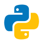
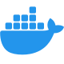

<!-- # 

 -->

# Sobre Mí

¡Hola! Soy Marco Reinoso, un desarrollador apasionado por la tecnología y la programación. Trabajo con una variedad de tecnologías, incluyendo Vue.js, FastAPI, Python, TypeScript y Docker.

------------

  
  
  
  
  
  
  

## GitHub Trophies

## Habilidades

- **Lenguajes**: Python, JavaScript, TypeScript, Dart
- **Frameworks**: Vue 3, FastAPI, Flutter
- **Herramientas**: Docker, Git

<!--
**MarcoReinoso19/MarcoReinoso19** is a ✨ _special_ ✨ repository because its `README.md` (this file) appears on your GitHub profile.

Here are some ideas to get you started:

- 🔭 I’m currently working on ...
- 🌱 I’m currently learning ...
- 👯 I’m looking to collaborate on ...
- 🤔 I’m looking for help with ...
- 💬 Ask me about ...
- 📫 How to reach me: ...
- 😄 Pronouns: ...
- ⚡ Fun fact: ...
-->
